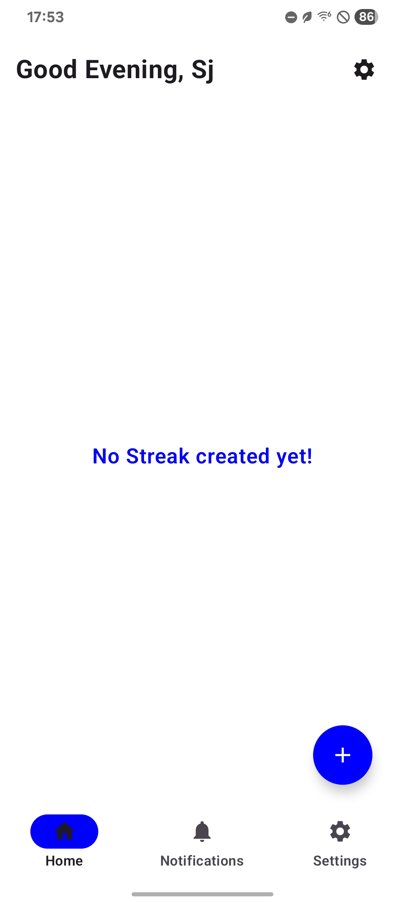
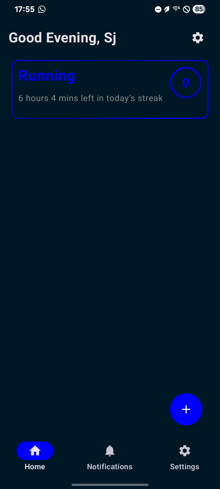
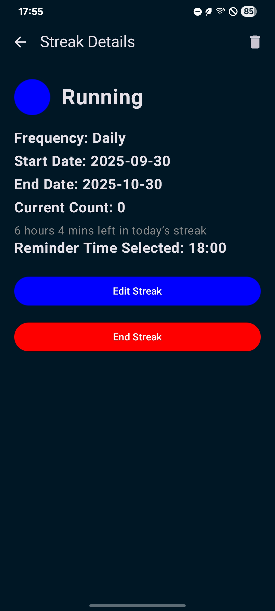
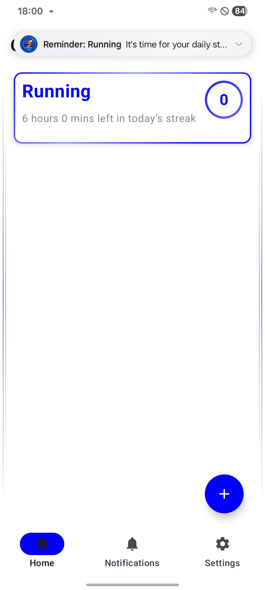
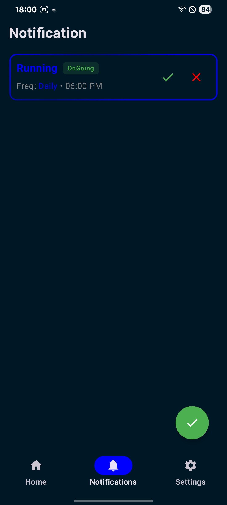

# 🔥 Streaks – Habit Tracking App

**Streaks** is a habit tracking app that helps users build consistent routines by creating and managing daily tasks.  
With Streaks, users can set custom streaks, track progress over time, and stay motivated through **visual feedback**, all within a clean and intuitive **Jetpack Compose UI**.

---

## 📱 Screenshots

    
    
    
    
    
  
  
  

---

## ✨ Features
- ✅ Create and manage custom streaks  
- ✅ Track progress over time  
- ✅ Daily reminders to stay on track  
- ✅ Visual progress indicators for motivation  
- ✅ Modern UI built with Jetpack Compose  

---

## 🐞 Known Issues / To-Do
- ❌ Streaks reset incorrectly if timezone changes  
- ❌ Notification service needs optimization  
- 🚧 Add cloud backup & sync (planned)  
- 🚧 Add widget support for quick streak updates (planned)  

---

## 🛠️ Tech Stack
- **Language:** Kotlin  
- **UI:** Jetpack Compose, Material Design 3  
- **Architecture:** MVVM (Model – ViewModel – Repository)  
- **Database:** Room / SQLite  
- **Other:** Coroutines, Flow, Navigation Component  

